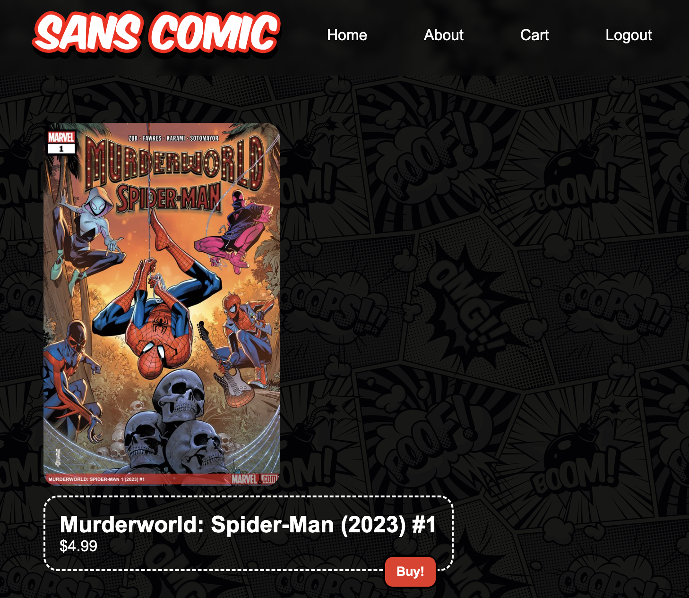
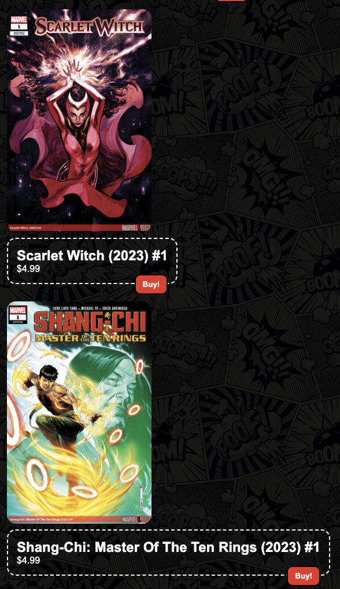

# CSS Practice

### To Do
1. Fork this repository
2. Clone it locally on your computer
3. Open it with VSCode and Click "Go Live"
4. Now, do the following exercise:

### Exercise
1. Make this webpage look like the following screenshots:

#### Helpful Tip:
Refer to the **"Key Terms"** documents in our [class repository](https://github.com/The-Marcy-Lab-School/2024-Spring-Curriculum-Nirvana). Along with the **"Mod 2 Resources"** section to figure out how to do this.

